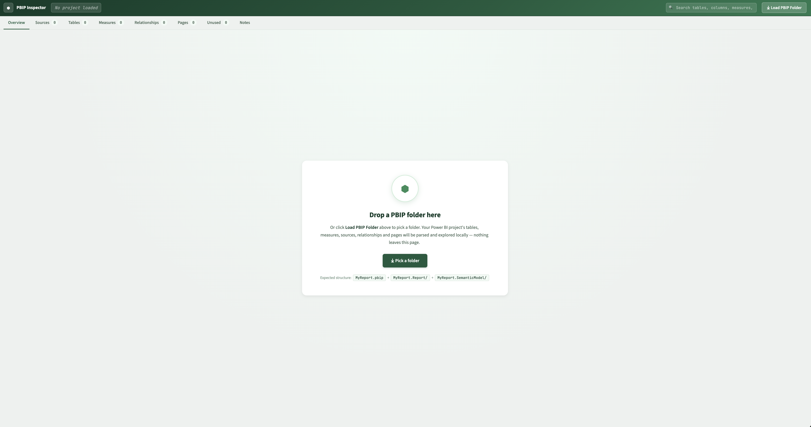
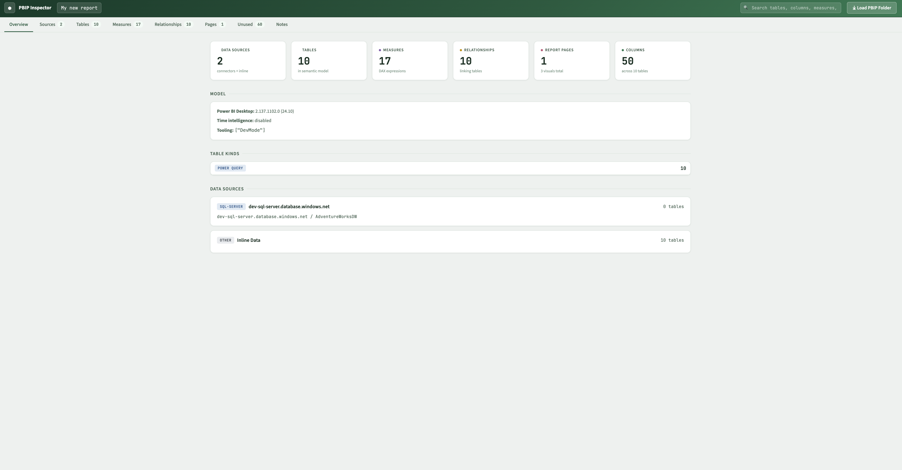
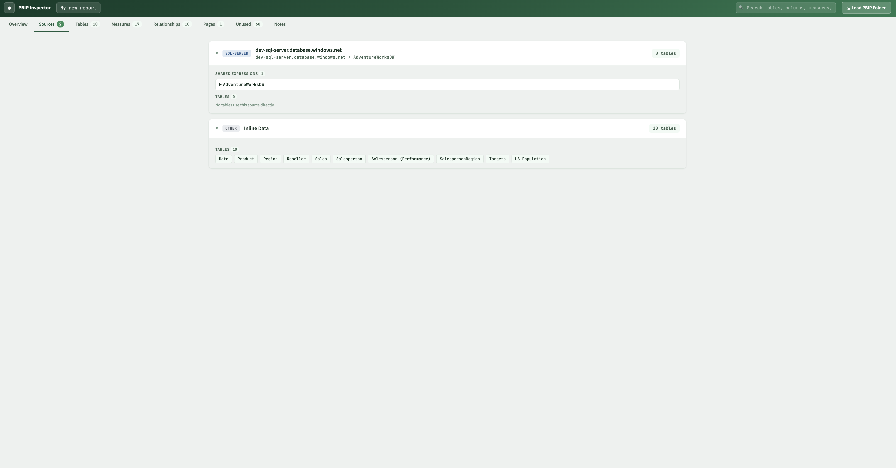
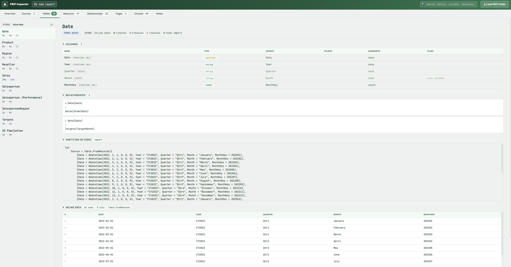
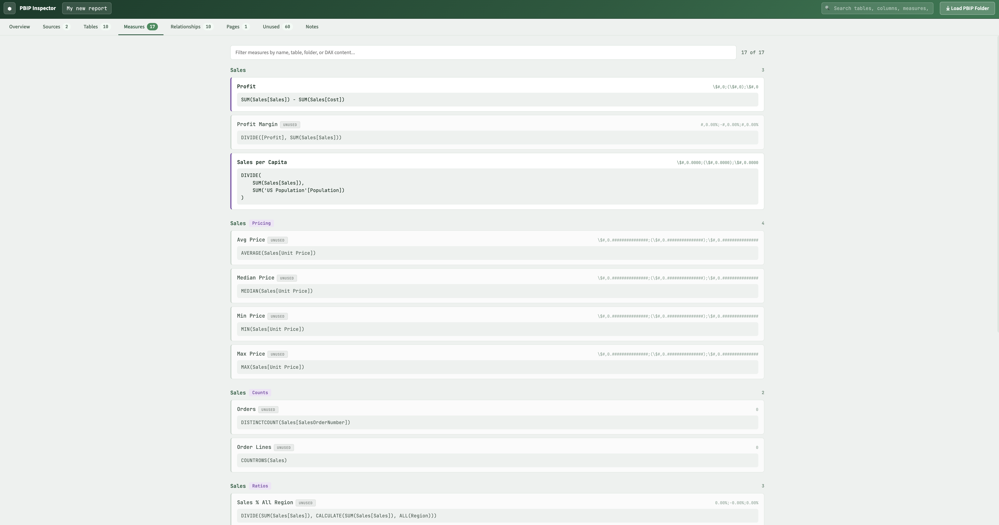
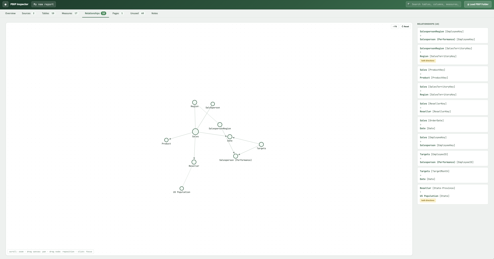
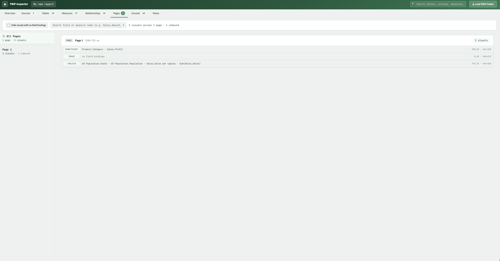
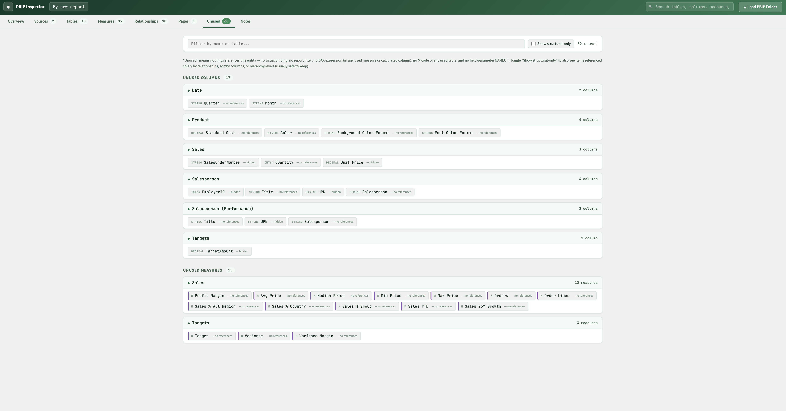
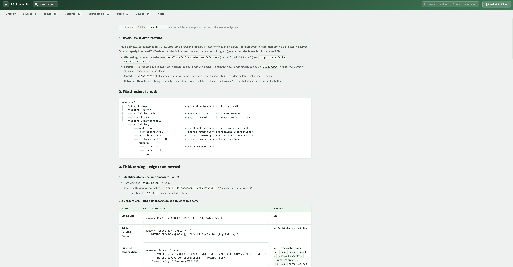

# PBIP Inspector

A self-contained HTML tool for exploring **Power BI Project (PBIP)** folders. Drop a PBIP folder into the browser and everything is parsed and rendered locally.

**No network calls. No uploads. No backend.** Open the HTML file, drop your folder, and inspect.

🔗 **[Try it live](https://sharathpyata.github.io/pbip-inspector/)** — no install needed. Your PBIP never leaves your browser.

---

## Screenshots

<table>
<tr>
<td width="50%" align="center">
<b>Drag-and-drop home</b><br>

</td>
<td width="50%" align="center">
<b>Overview</b><br>

</td>
</tr>
<tr>
<td width="50%" align="center">
<b>Sources</b><br>

</td>
<td width="50%" align="center">
<b>Tables</b><br>

</td>
</tr>
<tr>
<td width="50%" align="center">
<b>Measures</b><br>

</td>
<td width="50%" align="center">
<b>Relationships</b><br>

</td>
</tr>
<tr>
<td width="50%" align="center">
<b>Pages</b><br>

</td>
<td width="50%" align="center">
<b>Unused</b><br>

</td>
</tr>
<tr>
<td align="center" colspan="2">
<b>Notes</b><br>

</td>
</tr>
</table>

*(Screenshots use Microsoft's public AdventureWorks PBIP sample.)*

---

## Quick start

1. Open `PBIP Inspector.html` in a modern browser (Chrome / Edge 113+, Firefox 113+, or Safari 16.4+).
2. **Drag** a PBIP folder into the page, or click **Pick a folder** and select one.
3. Click through the tabs at the top.

The file can be opened directly from disk — no web server required.

---

## What's a PBIP folder?

In Power BI Desktop, **File → Save As → Power BI Project (folder)** saves the report as a directory tree:

```
My report/
├── My report.SemanticModel/
│   └── definition/
│       ├── model.tmdl
│       ├── expressions.tmdl
│       ├── relationships.tmdl
│       └── tables/
│           └── *.tmdl
└── My report.Report/
    └── report.json
```

PBIP Inspector reads the `.SemanticModel/definition/*.tmdl` files for the data model and `.Report/report.json` for the report layout.

---

## Views

| Tab | What it shows |
|---|---|
| **Overview** | Big-number tiles, model metadata (PBI version, time-intelligence settings), table-kind breakdown, data-source summary |
| **Sources** | Grouped data sources (Snowflake, SQL Server, Dataverse, SharePoint, Excel, OData, Web…). Multiple expressions hitting the same host collapse into one card, each listing its shared expressions and the tables that pull from it |
| **Tables** | Master/detail browser. Left rail lists tables; right pane shows columns, measures grouped by display folder, calculation items, hierarchies, relationships, partition M code, inline data, extracted SQL, and annotations |
| **Measures** | Flat searchable list of all DAX measures, grouped by table and display folder, with full DAX |
| **Relationships** | Force-directed graph. Pan, zoom, drag, hover-to-highlight; arrow markers; dashed lines for bidirectional cross-filter |
| **Pages** | Master/detail like Tables. "📑 All Pages" shows the stacked list of every page; selecting a specific page shows just that page's visuals. A search box at the top filters by field or measure name (e.g. `Sales.Amount`, `Profit`) and highlights matches inline |
| **Unused** | Columns and measures with no references in visuals, filters, DAX, or M code. Toggle to also show "structural-only" items (referenced only by relationships / sortBy / hierarchies) |
| **Notes** | Self-documenting reference describing exactly what the parser supports. Open even without loading a folder to read it |

---

## What's parsed

| Layer | Detail |
|---|---|
| **TMDL** | Model annotations, tables, columns (data types, format strings, sort-by, lineage tags), measures (DAX, single-line / triple-backtick / indented), calculated columns, hierarchies, calculation groups (with precedence and items), partitions (Power Query M / calculated / calculation-group), table relationships |
| **M (Power Query)** | Connector patterns, inline data (`Table.FromRecords`, `Table.FromRows`, base64+deflate-compressed inline data), SQL extracted from native queries, all M string escape sequences (`#(lf)`, `#(cr)`, `#(2605)`, etc.) |
| **Report JSON** | Pages, visuals, field bindings (`queryRef`, structured `Column` / `Measure` / `Hierarchy` / `HierarchyLevel` refs), visual positions and z-order, filter references, conditional formatting refs |

---

## Data sources detected

| Connector | M pattern |
|---|---|
| SQL Server | `Sql.Database` |
| Oracle | `Oracle.Database` |
| Snowflake | `Snowflake.Databases` |
| Dataverse | `CommonDataService.Database` / `Cds.Contents` / `Dataverse.*` |
| SharePoint | `SharePoint.Files` / `SharePoint.Tables` / `SharePoint.Lists` |
| Excel | `Excel.Workbook(File.Contents(...))` |
| Web / API | `Web.Contents` / `Json.Document` / `OData.Feed` |
| Inline | `Table.FromRecords` / `Table.FromRows` (incl. base64+deflate compressed) |

Multiple expressions pointing to the same host collapse into one source card.

---

## Unused-detection

The **Unused** tab classifies each column / measure into:

- **Used** — referenced by a visual binding, filter, DAX expression, or M code of a used table
- **Structural only** — referenced only by relationships, `sortByColumn`, or hierarchy levels (usually safe to keep)
- **Unused** — no references anywhere

Detection is regex-based and errs on the safe side: if a column name appears in an unrelated string literal, it'll be counted as used.

---

## Privacy & security

- **Local-only.** All parsing happens in your browser via the File API. No requests are made to any server.
- **No telemetry.** No analytics, no ping, nothing phones home.
- **No external dependencies.** Everything is embedded inline — D3.js (for the relationships graph in the full version), all CSS, all JS.
- **Open directly from disk.** No web server required; double-click works.

This means you can drop a PBIP that contains internal SQL, schema names, or sensitive data into the page without worrying about anything leaving your machine.

---

## Browser requirements

- A modern Chromium-based browser (Chrome / Edge 113+), Firefox 113+, or Safari 16.4+
- The compressed-inline-data decoder uses the `DecompressionStream` API, which requires the versions above. Everything else works in slightly older browsers
- Folder drop & picker rely on `webkitGetAsEntry()` and `<input type="file" webkitdirectory>` — supported in all modern browsers

---

## Known limitations

- **PBIR per-file report format** is not supported (each visual in its own JSON file). Only the legacy single-`report.json` format is read.
- **Multi-line calculated-column DAX** (backtick-fenced or indented) is only partially captured — single-line definitions are fully read.
- **KPI definitions, detail-rows expressions, formatStringDefinition DAX** are present in the model but not parsed for entity references.
- **Translations and cultures** are present in TMDL but not surfaced.
- **GroupRef (binning) and RoleRef (RLS)** are not specifically handled.

---

## Tips

- The **Notes** tab is accessible without loading a folder — read it to see the parser's full feature list.
- In **Tables**, related-table chips at the bottom of a table's detail jump to that table without losing your sidebar scroll position.
- In **Pages → All Pages**, click any page name to drill into just that page's view. The search box at the top works in both All Pages and single-page views.
- The relationships graph supports **drag** (reposition a node), **scroll** (zoom), **hover** (highlight), and the **Fit** button (reset zoom).
- Hidden tables (auto-date tables, `isHidden` flags) are filtered out by default to match Power BI Desktop's Fields pane. Toggle **Show N hidden** in the header to see them.

---

## Sharing

This is a single static HTML file. Email it, drop it on Slack, copy it to a USB stick — it works the same everywhere. The folder you drop in stays on your machine.
